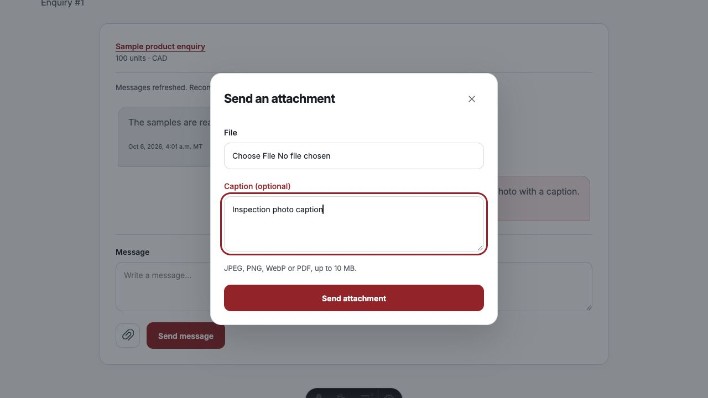
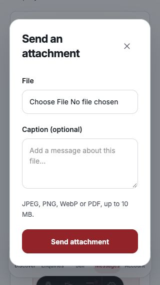
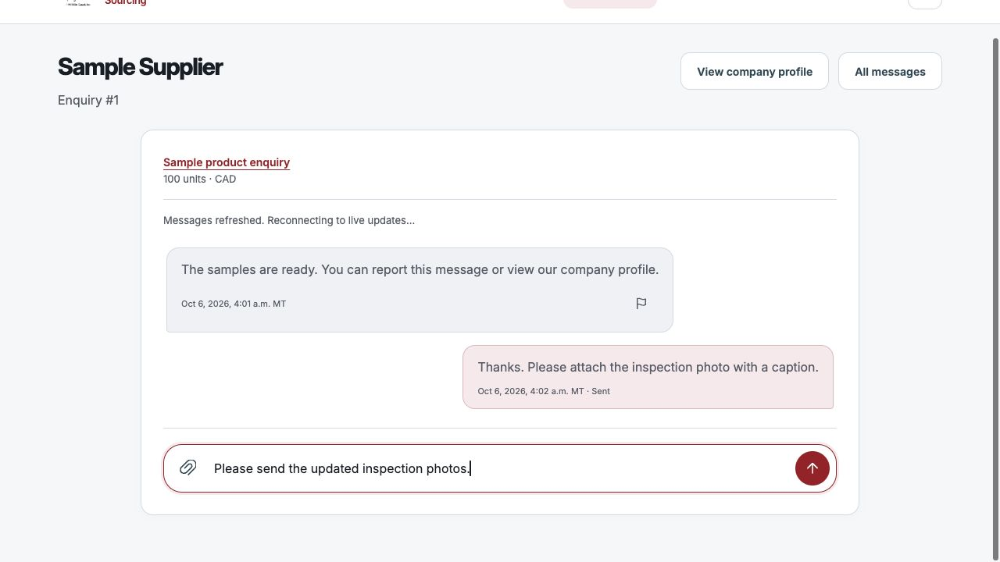
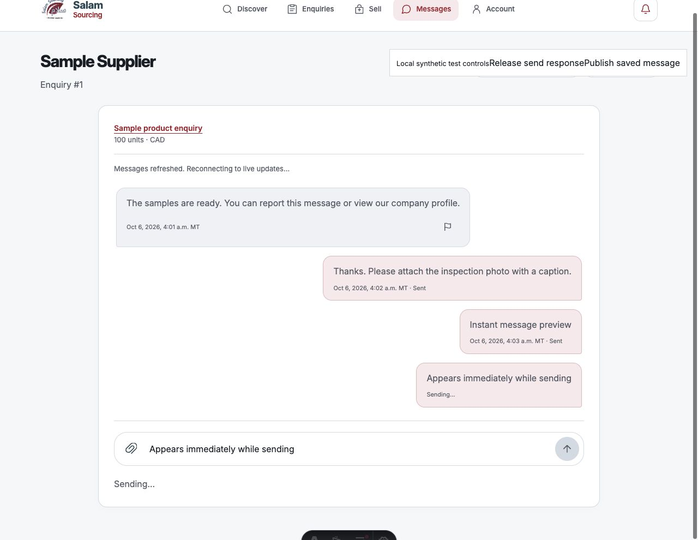

# Chat icons and caption review — 2026-10-06

Implemented in the local web and Flutter working trees at the user's request.
No backend contract or database change was needed.

## Web

- Incoming message reports use a compact flag icon with an accessible **Report
  message** label and tooltip, matching Flutter. Server-rendered, refreshed and
  older messages use the same icon and authorized report destination. Outgoing
  messages do not offer self-reporting.
- A paperclip beside Send opens an accessible attachment dialog with a file
  picker, optional caption and Send attachment action. The inline file details
  panel was removed. The popup fits narrow screens and scrolls within short
  viewports; native dialog focus trapping and Escape dismissal remain available.
- Closing and reopening preserves the selected file/caption. Failed uploads
  preserve the retry intent; captions and files cannot silently change that
  intent. Sending locks the fields and dismiss controls until confirmation.
  Success resets the draft, closes the popup and refreshes the conversation.
- Escape/Close returns focus to the paperclip. Private workspace discard, logout
  and page exit close the top-layer dialog and clear its private form contents.

## Flutter

- Captions were already supported in message storage and attachment retries.
  Selecting a file now opens a review sheet where the user can edit the caption
  before explicitly sending. The current composer draft seeds the caption.
- Cancel sends nothing and preserves the original composer. An empty caption is
  allowed. Edited captions are sent with the file; the source composer is cleared
  only when the attachment succeeds and that source draft is still unchanged.
- Repeated file-pick actions are guarded. Uncertain upload retries keep the same
  file, caption and request ID. Picker/read failures give useful feedback.
- New caption, Cancel, Close and Send controls include tap haptics. A scrollable
  sheet, wrapping actions and multiline validation keep it usable with a narrow
  viewport and an open keyboard.

## Verification

- Web: **156 tests passed**, type check has zero errors/warnings (six existing
  deferred-push hints), production build succeeds and **378 HTTP assertions pass**.
- Flutter: **140 tests passed**, clean analysis; three new caption-review widget
  tests cover editing and haptics, empty/cancelled captions, UTF-16 boundaries and
  a 320-pixel viewport with a 250-pixel keyboard inset. The caption and attachment
  retry suite also passed separately (10 tests).
- Actual browser interaction with an isolated synthetic workspace checked the
  flag/paperclip, popup file chooser/caption, Close/reopen preservation, a simulated
  interrupted upload and successful retry. Success closed and cleared the popup.
  Escape restored focus. At 320 pixels, the popup stayed within the viewport and
  the document had no horizontal overflow.
- This preview used synthetic local data and responses. No messages or customer
  records were written to the hosted backend. Live account/device acceptance,
  deployment and the deferred browser-push rollout remain separate gates.

## Integrated composer follow-up

The web paperclip and circular send-arrow buttons now sit inside one rounded
message box. The text area grows to 180 pixels, then scrolls; clearing it restores
the compact height. Text and 44-pixel icon targets occupy separate columns, so
the buttons cannot cover typed text. Accessible labels, focus states, the
attachment/caption popup and the explicit failed-message retry action remain.
Typing keeps the composer above the mobile navigation.

Actual browser checks verified desktop controls and popup access, multiline
wrapping without horizontal overflow at 320 pixels, icons remaining above the
mobile navigation and the textarea returning to 44 pixels after clearing.
The local synthetic preview made no hosted customer writes. Web checks/build
and the 156 existing tests passed for this follow-up; Flutter's existing controls
already sit inside its message input and did not need repositioning.

This update follows [functional parity corrections](functional_parity_fixes_2026-10-06.md).
Its original screenshot and test counts remain historical evidence.

## Matching Flutter composer follow-up

Flutter now uses the same rounded message-box treatment: paperclip on the left,
circular upward send arrow on the right, and a locally scoped 24-pixel border
radius. Both icons retain 48-pixel touch targets. The input grows from one to
four lines, then scrolls; the keyboard Return key inserts a newline and the
send icon sends the message. Composer taps include selection haptics, while
existing attachment and send haptics, caption review and retry behavior remain.

Flutter analysis reported no issues, all **140 existing tests passed**, and the
changed screen passed the whitespace check. No backend change was needed.

## Empty message state

Both composers now disable Send and show a gray circle for an empty or
whitespace-only draft. Typing real text restores the red send button; clearing
the draft disables it again. Flutter listens to the text controller so successful
message and attachment clears update the button too. Web preserves its pending
retry lock and recomputes Send after input and send completion. Attachment
selection remains available without a text message.

The existing Flutter retry widget test now checks initial/whitespace disablement,
enablement after typing, and disablement after a successful retry clears the draft.

## Immediate text-message feedback

Both clients previously waited for another authorized history fetch after sending
before displaying their own message. Text messages now appear immediately as a
local outgoing bubble with **Sending…**, change to **Sent** after acknowledgement,
and merge into server history by the existing `client_message_id`. These local
bubbles never enter server-ID pagination cursors or enable reports/read receipts.
Only the signed-in sender's request ID is exposed in the web history response.
The Flutter history reader uses the same existing database column; no schema,
authorization or write-contract change was needed.

Unconfirmed sends preserve the draft and immutable request ID. Retrying reuses the
same bubble. A history confirmation arriving before a lost send response wins,
so the UI does not show a false failure or a duplicate. Multiple acknowledged
messages can remain visible while history catches up. Confirmation of an older
send does not clear a newly entered identical draft. Flutter's per-message retry
action uses the existing haptic send handler, and reconciliation also covers
older history and individual message refreshes.

Verification: **161 web tests and 143 Flutter tests passed**, web check has zero
errors/warnings (six existing hints), the web production build passes and Flutter
analysis is clean. New fixtures cover delayed responses, exact sender/request
matching, identical content with distinct requests, lost acknowledgements and
safe retry, including clearing a stale failure warning after late confirmation.
Actual browser interaction confirmed a visible **Sending…** bubble
during an eight-second synthetic send, then one saved bubble when history arrived.
This isolated preview made no hosted customer writes. Attachment upload/review
behavior is unchanged; this follow-up covers text messages.

