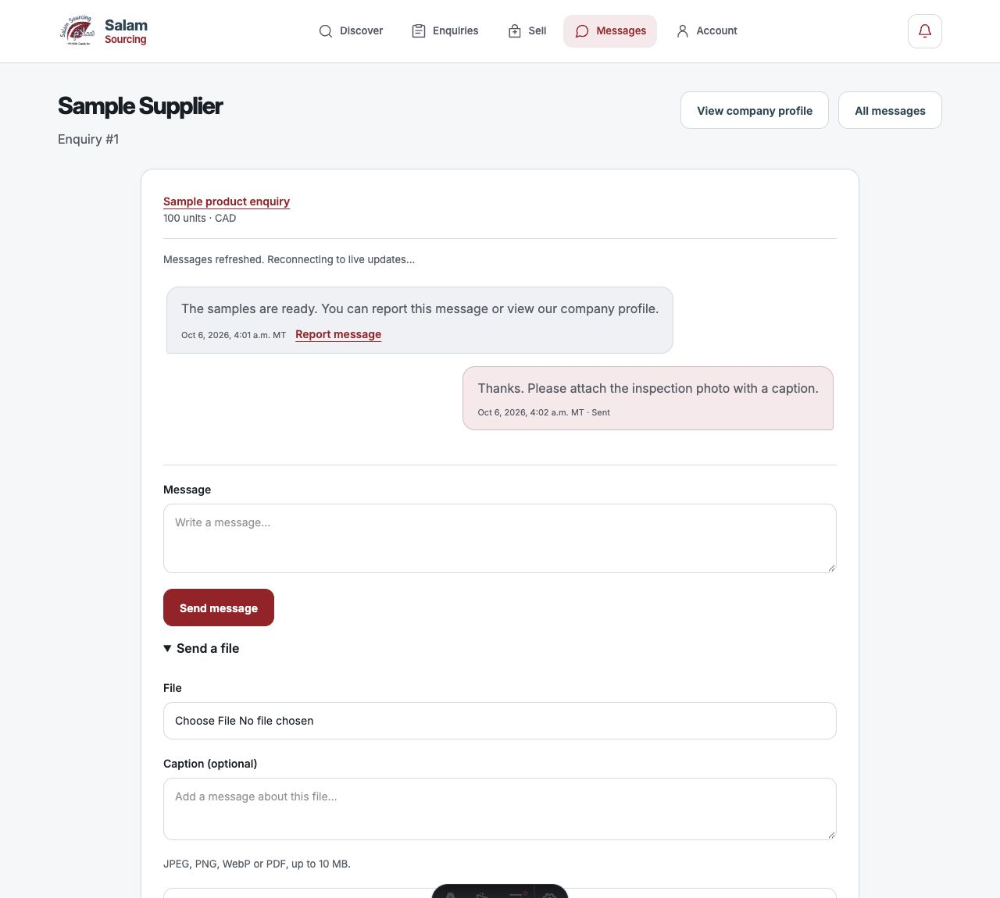

# Functional parity corrections — 2026-10-06

The seven S01–S07 gaps from the [latest source/contract audit](flutter_web_parity_followup_2026-10-06.md)
are implemented in the web and Flutter working trees and verified locally.
This report records the current code status. It does not claim deployment or
complete authenticated staging and physical-device acceptance.

## Corrections

| Finding | Implemented behavior                                                                                                                                                                                                                                                                                                                                                                |
| ------- | ----------------------------------------------------------------------------------------------------------------------------------------------------------------------------------------------------------------------------------------------------------------------------------------------------------------------------------------------------------------------------------- |
| S01     | Incoming web messages offer **Report message** in server-rendered, refreshed and older history. The existing authenticated safety action checks the target. Outgoing messages do not offer this action.                                                                                                                                                                             |
| S02     | Web file messages accept optional captions. Preparation records a SHA-256 caption hash, not private caption text, in the recovery cookie. Upload, message creation and committed retry reconciliation check the same caption, conversation and sender company. The selected file/caption remain available after failure; editing the retry draft cannot silently change its intent. |
| S03     | Web threads link directly to the authorized counterparty company profile. An unavailable company has no misleading profile link. Company verification badges remain off chat. Profile report/block actions use their existing authorization.                                                                                                                                        |
| S04     | Both clients apply matching new-write company/profile/message limits. Company creation requires business email; editing permits an existing blank email. Fresh authorized database values allow unchanged older fields to be saved without truncation or rejection of unrelated edits. A client-supplied baseline cannot bypass new-value validation.                               |
| S05     | Inline web review reporting and the general report form include all six reasons, including **Impersonation**. Both clients require a trimmed explanation of at least five characters and a raw maximum of 1,000 UTF-16 code units.                                                                                                                                                  |
| S06     | Web prepares listing photos before draft creation, previews and upload: maximum width 1,800 pixels, proportional height, quality 84 for supported lossy encoders, retaining JPEG/PNG/WebP format. Prepared files are reused across retry attempts. Both clients permit the exact listing/message bucket size boundary.                                                              |
| S07     | Both clients now enforce the same complete-export policy: at most 100 page requests and a 10 MiB aggregate compact-page response budget. Invalid subject/page/section data is rejected. An incomplete export is never returned as a successful download; larger exports direct users to support for a complete export.                                                              |

The export policy deliberately replaces Flutter's previous 10,001-request loop
and absence of an aggregate byte bound. This reconciles supported capacity with
the bounded web workflow; it does **not** implement streaming exports of arbitrary
size. Support handling for larger exports remains an operational requirement.

New-write company limits are legal/display name 200, description 4,000,
registration/tax number 200, country/province/city 100, address 500, postal code 30,
company contact number 50, business email 254 and website 500. Personal first/last
names are 80 each, contact number 60 and country 100. New chat text and captions
are 8,000 UTF-16 code units, consistently enforced before writes. Already stored
messages remain readable. Changed website values require safe HTTP(S) URLs;
unchanged older website values are preserved through unrelated authorized edits.

Web image preparation accepts JPEG/PNG/WebP source files up to 50 MiB and
100 million decoded pixels, then requires output at or below 5 MiB. Native uses
its existing image picker preparation. Browser and native encoders need not
produce byte-identical images. Web rejects unsupported encoder fallback and
oversized output rather than silently changing format. Filename, bucket MIME
and existing upload-intent checks remain enforced. Message files accept up to
10 MiB. Client request envelopes remain bounded, including Unicode captions.

Web chat and inbox timestamps also use the same explicit MT formatter before
and after automatic refresh, avoiding a change of time zone or presentation
when server-rendered history is replaced.

Existing native tap haptics are retained; the company-type dropdown now emits
selection feedback. No new native tap action was introduced without feedback.

## Backend and authorization

Selected hosted function and bucket metadata was read only. Existing reporting,
company update, message, attachment and export contracts support these changes.
The inspected `listing-images` bucket allows 5,242,880 bytes and JPEG/PNG/WebP;
`message-attachments` allows 10,485,760 bytes and JPEG/PNG/WebP/PDF.

No new database migration, backend deployment, Auth configuration change or
customer-data mutation was needed for S01–S07. Both clients continue using the
existing authenticated user, authorized company, permission, RLS, workflow-state
and Storage checks. No privileged client key or anonymous write path was added.

Browser push remains disabled and deferred at the user's request. Invitation
email remains deliberately rollout-disabled. These corrections do not enable
either integration or claim parity with native push delivery.

## Verification

- **156 web tests passed**, including nine new tests for legacy-field editing,
  Unicode limits, report choices/bounds, exact file limits, attachment captions
  and uncertain acknowledgements, changed retry intent and complete-export caps.
- **137 Flutter tests passed** in the final full run, including seven new
  client-contract/export tests and the updated authenticated support export fixture.
  The **19 relevant Flutter regression tests** also passed separately.
- Flutter analysis found **no issues**. Web type checking found **zero errors and
  zero warnings**, with six existing hints in deferred push code. Production build
  succeeded; **378 production HTTP assertions passed** against an isolated local
  preview with no real business writes.
- An isolated browser preview exercised actual application components/scripts
  with synthetic workspace data: incoming Report action, counterparty profile
  link, optional file caption, all six review report choices and 5–1,000 bounds,
  company wizard continuation with a blank existing email, and photo preparation.
  A real browser file selection resized a synthetic 3,600 × 2,400 JPEG to
  **1,800 × 1,200**. Chat and listing forms had no horizontal page overflow at
  390 pixels; desktop checks used 1,280 pixels.
- Browser checks did not submit reports/messages/listings to hosted customer
  records. The fixture's intentionally closed live stream causes its reconnecting
  label; that screenshot is layout evidence, not a live Realtime acceptance result.

Local command logs are temporary evidence under `/private/tmp/salam-functional-parity-*`;
the committed tests and this report are the durable references. Historical audits
retain their pre-fix observations. Unrelated Android UI-testing changes and
preexisting work in both repositories were preserved. No commit, push or release
was performed by this corrective turn.

## Remaining acceptance

Use [remaining_work.md](../remaining_work.md) for the open release gates: real
buyer/supplier cross-client continuation, roles and permission changes, failure
and concurrency cases, physical devices, production diagnostic retention/alerts,
and the explicitly deferred browser-push rollout. Local tests close the identified
implementation gaps, not every combination in that live acceptance matrix.
